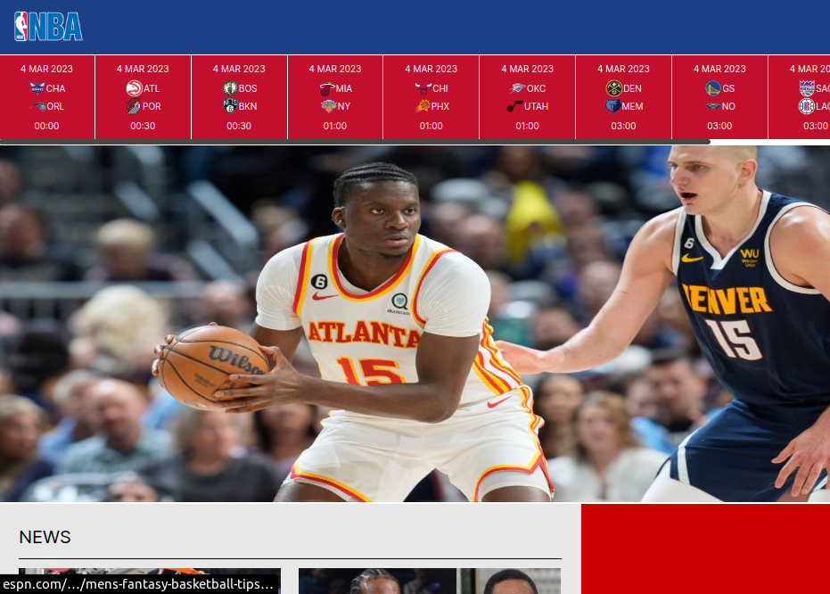

<h1>Projeto NBA WebSite</h1>

 Meu projeto consiste em um blog de notícias dedicado exclusivamente à NBA, uma das maiores ligas de basquete do mundo. O objetivo é manter os fãs da NBA sempre atualizados com as últimas notícias, resultados e informações sobre os próximos jogos da semana.
 

Para garantir a precisão e a confiabilidade das informações que o blog compartilha, a plataforma consome a API da ESPN, uma das principais fontes de informação sobre esportes. Com isso, temos acesso em tempo real aos resultados dos jogos já finalizados e podemos fornecer aos nossos leitores previsões precisas de quais serão os próximos jogos.
 

Além disso, o nosso blog possui um espaço em branco ao lado para anúncios. Isso permite que empresas tenham a oportunidade de atingir uma audiência altamente engajada e interessada em esportes, promovendo seus produtos e serviços para um público altamente qualificado.

  
<h1>Tecnologias utilizadas:</h1>
<ul>
  <li>JavaScript</li>
  <li>HTML</li>
  <li>CSS</li>
  <li>React</li>
</ul>
<h1>Como rodar o projeto:</h1>
Para que o projeto possa rodar em sua maquina, sera necessario ter instalado o node, e o gerenciador de pacotes NPM(node package manager). Apos todas as dependencias do projeto serem instaladas, basta abrir o terminal dentro da pasta do projeto, rodar o comando 'npm install' para que todas as dependencias sejam instaladas, e em seguida abrir o projeto com o comando 'npm install'
